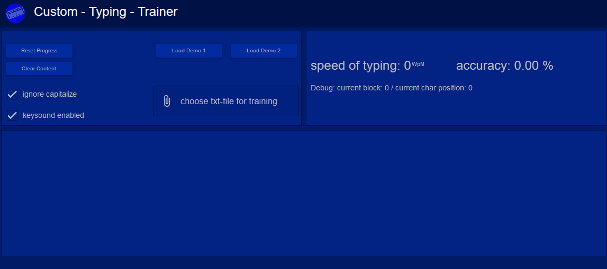

# custom-typing-trainer

### A simple web app for practice typing (created with vue3 / quasar)


### Try it: [https://oigty81.github.io/custom-typing-trainer](https://oigty81.github.io/custom-typing-trainer)

### Load your favorite text in the app and practice typing 

#
### Todo

- [x] create a global custom button component
- [ ] the last (auxiliary) character (is invisible) should not be interpreted as a typing character
- [ ] Set focus back to browser(tab) after a text file has been uploaded from another program via drag'n'drop
- [ ] suppress opening browser-seachfield when press '/' in firefox
- [ ] find better solution for remove focus for a controls
- [ ] improve generate content (last block in loop)
- [ ] improve typing progress field scoll behavior to current position
- [ ] refactoring appController store
- [ ] dedection a pause for measure the words per minutes when stop typing within a word

# 
## Project setup

### Prerequisite

- [Node.JS v18](https://nodejs.org/download/release/v18.18.0/)

### Install the repository
```
git clone https://github.com/Oigty81/custom-typing-trainer.git
cd custom-typing-trainer
npm install
```

### Compiles and hot-reloads for development
```
npm run dev
```

### Compiles and minifies for production
```
npm run build
```

### Run your unit tests
```
npm run test
```

# 